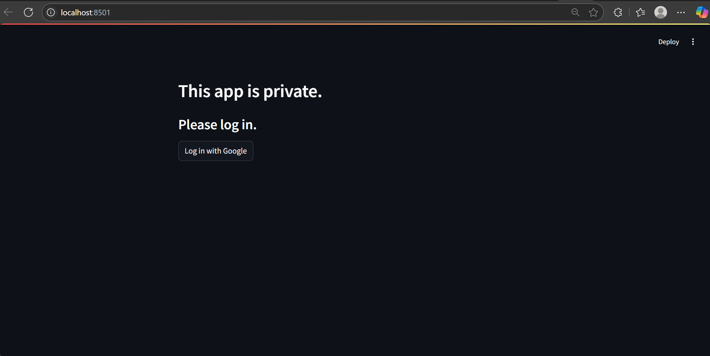
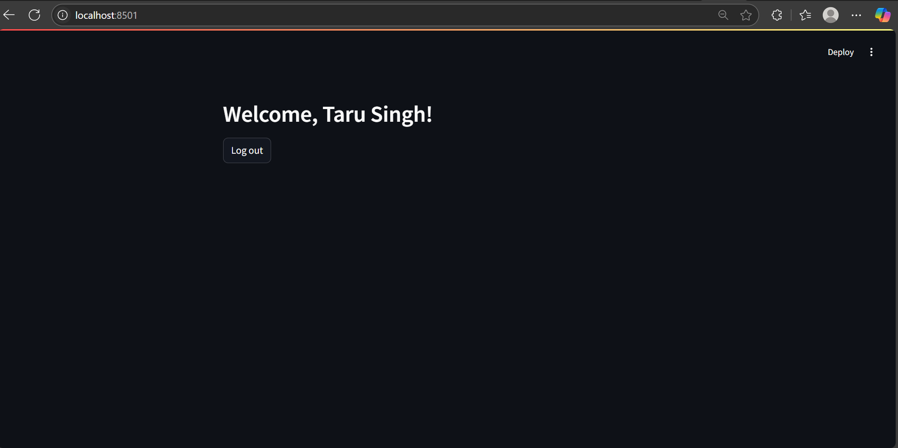

# 🌐 Streamlit Google Authentication App

This project demonstrates how to implement **Google OAuth 2.0 Authentication** in a **Streamlit** app using Streamlit Community Cloud secrets and Google Cloud Console.

## 🚀 Features

- 🔐 Google Sign-In via OAuth 2.0
- 🌈 Streamlit interface
- 🧠 User session management
- 🔒 Secure credential handling using `.streamlit/secrets.toml`

## 🛠️ Tech Stack

- [Streamlit](https://streamlit.io/)
- [Google Cloud Console](https://console.cloud.google.com/)
- [streamlit-authenticator](https://docs.streamlit.io/library/advanced-features/authentication)
- OAuth 2.0 via `streamlit_oauth`

---

## 📸 Demo



---

## 📦 Setup Instructions

### 🔑 Step 1: Create a Google OAuth 2.0 Client ID

1. Visit the [Google Cloud Console](https://console.cloud.google.com/).
2. Create a new project or use an existing one.
3. Go to **APIs & Services > Credentials**.
4. Click **Create Credentials** > **OAuth client ID**.
5. Choose `Web application` and add `https://<your-app-name>.streamlit.app` as an **Authorized redirect URI**.
6. Save your `client_id` and `client_secret`.

---

### ⚙️ Step 2: Add secrets to Streamlit

Create a `.streamlit/secrets.toml` file:

```toml
[oauth]
client_id = "your-client-id.apps.googleusercontent.com"
client_secret = "your-client-secret"
```

---

### 🧪 Step 3: Run the App Locally
```
pip install streamlit streamlit-authenticator
streamlit run app.py
```

---